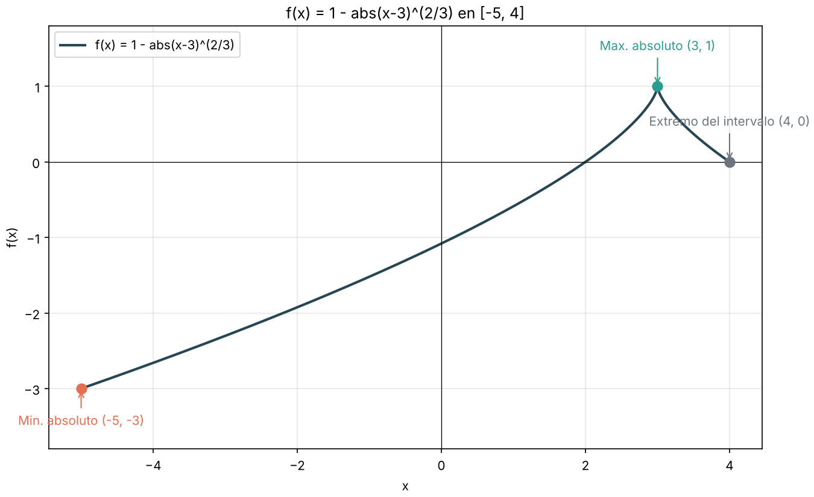
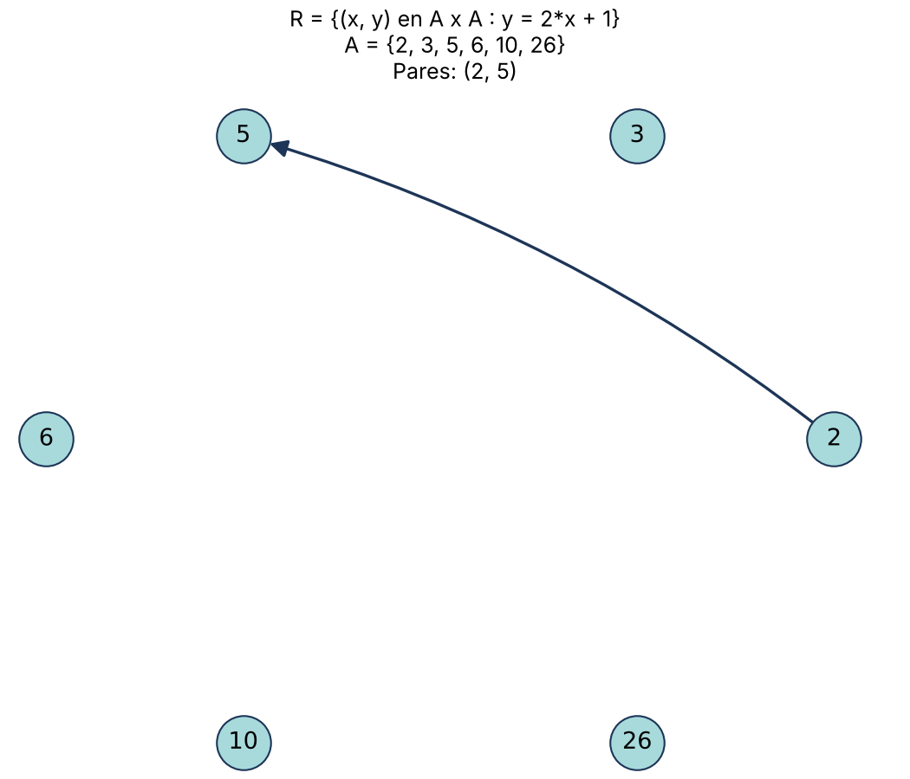
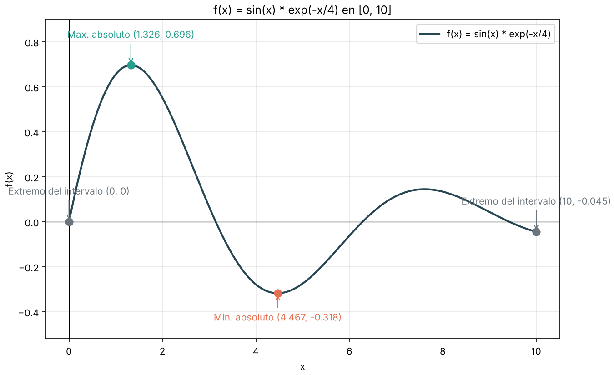
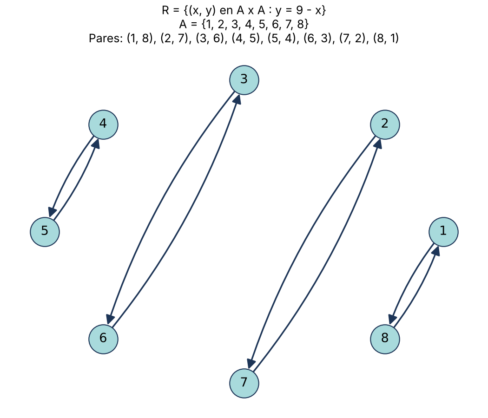

# Graficadora de funciones y relaciones

[](https://github.com/santyxswc/graficadoraFunciones-py/actions/workflows/ci.yml)


Herramienta de línea de comandos para **cálculo** y **matemáticas discretas**:

- **Funciones**: grafica cualquier `f(x)` en un intervalo cerrado y encuentra y marca su **máximo y mínimo absolutos**,
  incluso en picos sin derivada como el de `1 - |x-3|^(2/3)`.
- **Relaciones binarias**: dibuja `R = {(x, y) ∈ A×A : y = regla(x)}` como un **dígrafo** y dice si es reflexiva,
  simétrica, antisimétrica y transitiva.

Nació como dos scripts para un curso (una gráfica y un dígrafo con valores fijos en el código) y se convirtió en un
paquete instalable, con entrada segura, pruebas automáticas y CI.

| Función con extremos absolutos | Relación como dígrafo |
| --- | --- |
|  |  |
|  |  |

## Instalación

```bash
git clone https://github.com/santyxswc/graficadoraFunciones-py.git
cd graficadoraFunciones-py
python -m venv .venv
source .venv/bin/activate        # Windows: .venv\Scripts\activate
pip install -e .
```

## Uso

### Funciones

```bash
graficadora funcion "1 - abs(x-3)^(2/3)" --desde -5 --hasta 4
```

```text
Max. absoluto (3, 1)
Min. absoluto (-5, -3)
Extremo del intervalo (4, 0)
```

Abre una ventana con la gráfica. Para guardarla como imagen: `--guardar grafica.png` (también `.svg` o `.pdf`).

- Operadores: `+ - * / %` y potencia con `^` o `**`.
- Funciones: `abs sqrt cbrt exp log ln log10 sin cos tan asin acos atan sinh cosh tanh floor ceil`.
- Constantes: `pi`, `e`.

### Relaciones

```bash
graficadora relacion 2 3 5 6 10 26 --regla "2*x + 1"
```

```text
Pares: (2, 5)
Reflexiva: no
Simetrica: no
Antisimetrica: si
Transitiva: si
```

### Como biblioteca

```python
from graficadora import Expresion, RelacionBinaria, analizar_extremos

g = Expresion("1 - abs(x-3)^(2/3)")
analisis = analizar_extremos(g, -5, 4)
print(analisis.maximo)  # Extremo(x=3.0, y=1.0, tipo=<TipoExtremo.MAXIMO_ABSOLUTO ...>)

r = RelacionBinaria.desde_regla([1, 2, 3], Expresion("x"))
print(r.propiedades())  # {'reflexiva': True, 'simetrica': True, 'antisimetrica': True, 'transitiva': True}
```

## Diseño

```text
src/graficadora/
├── expresion.py    Intérprete seguro de expresiones (árbol AST con lista blanca, sin eval)
├── analisis.py     Extremos absolutos: malla + búsqueda de sección áurea + bisección en bordes del dominio
├── relaciones.py   Relación binaria y sus propiedades
├── graficos.py     Dibujo con Matplotlib y NetworkX (única parte que depende de ellos)
└── cli.py          Línea de comandos (argparse)
```

- **Cálculo separado del dibujo**: `analisis` y `relaciones` devuelven datos puros; `graficos` solo dibuja.
  Por eso se pueden probar sin abrir ventanas y reutilizar desde otro programa.
- **Seguridad**: el texto del usuario nunca se ejecuta con `eval`. `__import__('os')` y similares se rechazan.
- **Precisión**: el máximo de `1 - |x-3|^(2/3)` se encuentra exactamente en `x = 3` aunque la función no sea
  derivable ahí; donde la función no existe (como `sqrt(x)` con `x < 0`) se deja un hueco en vez de fallar.
- **Calidad**: 39 pruebas (97 % de cobertura), `ruff` para estilo y CI en Python 3.10 a 3.13 y Windows.

## Desarrollo

```bash
pip install -e ".[dev]"
pytest                 # pruebas + ejemplos de la documentación
ruff check . && ruff format --check .
```

## Autor

**Santiago Caicedo** — [@santyxswc](https://github.com/santyxswc)
